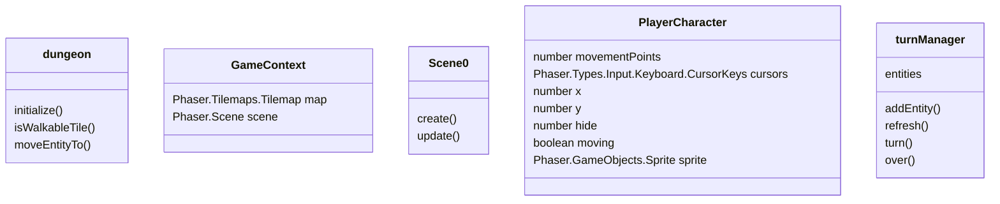

```mermaid
classDiagram

    class dungeon{
      initialize()
      isWalkableTile()
      moveEntityTo()      
    }

    class GameContext{
        Phaser.Tilemaps.Tilemap map
        Phaser.Scene scene
    }

    class Scene0{
        create()
        update()
    }

    class PlayerCharacter{
        number movementPoints
        Phaser.Types.Input.Keyboard.CursorKeys cursors 
        number x
        number y
        number hide
        boolean moving
        Phaser.GameObjects.Sprite sprite
    }

    class turnManager{
        entities
        addEntity()
        refresh()
        turn()
        over()
    }

```
